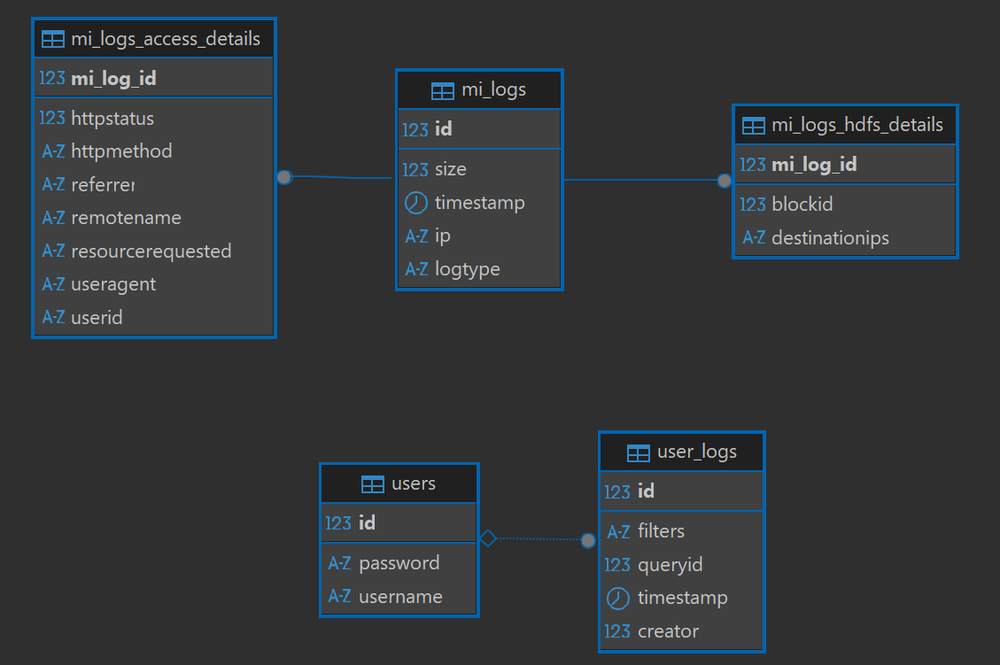

# MiLogDB
#### Michael Korres - Department of Informatics & Telecommunications - University of Athens
#### Repo Link: https://github.com/michael-korres-mk/mi-log-db

## Data Import
Some numbers: (before DB normalization)

| Batch Size | Time (s) | Time (min) |
|------------|----------|-------------|
| 1          | 3296.01  | ~54.93      |
| 100        | 126.17   | ~2.10       |
| 200        | 112.40   | ~1.87       |
| 500        | 97.02    | ~1.62       |
| 1000       | 94.21    | ~1.57       |

- Persist per 10 batches in memory
- Stayed with Batch Size = 1000 w/ around 2min on average (parsing & persisting)
- To import the datasets, add them in the src/main/resources/ and hit:
  - Windows: `Invoke-RestMethod -Method GET -Uri http://localhost:8080/data-import`
  - Linux: `curl -X GET http://localhost:8080/data-import`
  - The total time will be returned
- Extended usage of Java regular expressions, built through the definition of core blocks & re-usability w/ focus on the DRY principle.

## DB Schema

- Almost all logs share some domains (IP,timestamp,etc.).
- All logs are assigned a log type (ACCESSED, RETRIEVED, SERVED, etc.)
- Details depending on the log type are held on a different relation, having the same primary key (id) as the main log (1-1 correlation).
- Timestamps' zones are ignored.
- Destination IPs are concatenated,using ',' as delimiter and saved a string.
- Users retrieve their history from the respective relation.
- **Result:** **Simple schema** + **Max 1 JOIN for most queries** + **Minimized space waste**

**NOTE:** Uncomment `ddl-auto: create` & run server to generate DB schema.

## Indexes
- MiLog
  - IP
  - Timestamp
- User
  - Username

The above domains are mainly used for the respective queries. \
Thus, indexes have been created based on them to speed things up.

## Software Design
- SQL is mainly executed through custom JPA methods
- Queries return generated projections (DTOs).
- Queries are issued through a main logs/{qid} page
- Inserts / Updates can be done through the _Search via IP_ page, by clicking the _New log_ or the _Edit_ of the corresponding log links and redirecting to the edit page.
- UI,though statically generated using Thymeleaf template engine, is as dynamic as possible.
  - This is achieved by declaring the query filters & projection columns and "injecting" them in the template.
- Queries without filters, run out of the box.
- Queries with filters need values in their filters to return results.
- After each query issuing or equivalently, every access to /logs/{qid} the user history gets updated.
- In the History page, the user can find his queries & re-issue them.

**Note:** qid=14 <=> _Search via IP_ query

## Security
- Session-based authentication.
- Automatic login on after user signup
- Spring Security handles login (POST).
- UserController handles signup (POST).
- The "/" page is the combined login/signup UI.
- Unauthorized access to protected pages redirects to the login page.